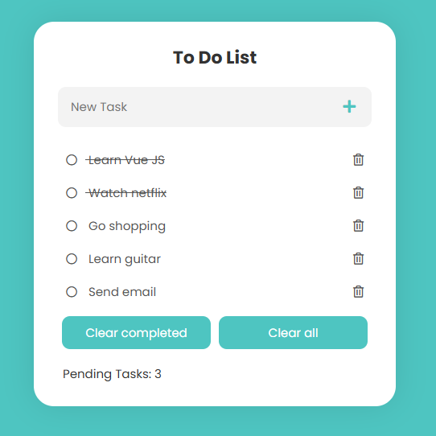

# Vue ToDo App

A simple and responsive ToDo application built using **Vue.js** that helps users manage daily tasks efficiently. The application allows users to add, complete, and delete tasks with a clean and intuitive interface.

---

## Features

- Add new tasks
- Mark tasks as completed
- Delete tasks
- Clear completed tasks
- Responsive and user-friendly interface
- Real-time task updates using Vue reactivity

---

## Technologies Used

- Vue.js
- HTML5
- CSS3
- JavaScript

---

## Project Structure

```
vue-todo-app
│
├── public
│   └── index.html
│
├── src
│   ├── components
│   │   └── TaskItem.vue
│   │
│   ├── App.vue
│   ├── main.js
│   └── assets
│
├── package.json
└── README.md
```

---

## Installation

Clone the repository

```
git clone https://github.com/YOUR_GITHUB_USERNAME/vue-todo-app.git
```

Navigate to the project folder

```
cd vue-todo-app
```

Install dependencies

```
npm install
```

Run the development server

```
npm run serve
```

The application will run at

```
http://localhost:8080
```

---

## Live Demo

You can view the live project here:

```
https://YOUR_GITHUB_USERNAME.github.io/vue-todo-app/
```

---

## Screenshots

_Add screenshots of your application here_

Example:

```

```

---

## Learning Outcomes

This project demonstrates:

- Vue component-based architecture
- Reactive data binding
- Event handling in Vue
- Frontend UI design using CSS
- Basic state management for tasks

---

## Future Improvements

- Add local storage support
- Task editing feature
- Task filtering (All / Completed / Pending)
- Dark mode support
- Drag-and-drop task reordering

---

## Author

**Syed Hassan Ahmed**

Master’s in Data Science  
University of St. Thomas

GitHub:  
https://github.com/hassansyed4

---

## License

This project is licensed under the MIT License.
