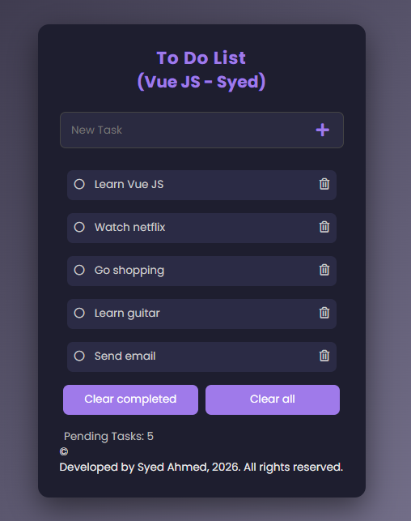

# Vue ToDo Application

A simple and responsive **Task Management (ToDo) web application** built using **Vue.js**. The application allows users to create, manage, and track daily tasks in an intuitive interface.

This project demonstrates the use of **Vue components, reactive data binding, and modern frontend styling**.

---

## Features

- Add new tasks
- Mark tasks as completed
- Delete tasks
- Clear completed tasks
- Responsive and clean user interface
- Dynamic updates using Vue reactivity

---

## Technologies Used

- Vue.js
- JavaScript (ES6)
- HTML5
- CSS3

---

## Project Structure

```
Vue-Todo-App
│
├── end
│
├── start
│   ├── dist
│   ├── node_modules
│   ├── public
│   │   ├── favicon.ico
│   │   └── index.html
│   │
│   ├── src
│   │   ├── assets
│   │   │   ├── css
│   │   │   │   └── main.css
│   │   │   └── logo.png
│   │   │
│   │   ├── components
│   │   │   ├── Task-item.vue
│   │   │   └── Task.vue
│   │   │
│   │   ├── App.vue
│   │   └── main.js
│   │
│   ├── package.json
│   ├── package-lock.json
│   ├── vue.config.js
│   └── Project Image.png
│
└── README.md
```

---

## Installation

### 1. Clone the repository

```
git clone https://github.com/YOUR_USERNAME/vue-todo-app.git
```

### 2. Navigate to project folder

```
cd vue-todo-app/start
```

### 3. Install dependencies

```
npm install
```

### 4. Run development server

```
npm run serve
```

Application will start at:

```
http://localhost:8080
```

---

## Live Demo

If deployed using GitHub Pages:

```
https://hassansyed4.github.io/vue.js-todo-app/
```

---

## Application Screenshot

```

```

---

## Learning Outcomes

Through this project, the following concepts were practiced:

- Vue component architecture
- Data binding and event handling
- Task state management
- Frontend UI design with CSS
- Project structuring in Vue

---

## Future Improvements

Possible enhancements include:

- Local storage for task persistence
- Edit existing tasks
- Task filters (All / Completed / Pending)
- Drag and drop task reordering
- Dark mode UI

---

## Author

Syed Hassan Ahmed  
Master’s in Data Science  
University of St. Thomas

GitHub:  
https://github.com/hassansyed4

---

## License

This project is licensed under the MIT License.
